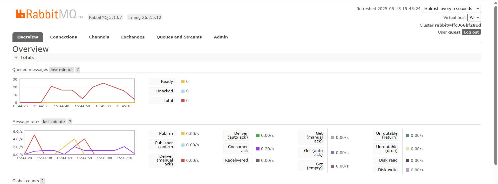

## a. What is AMQP?

**AMQP** stands for **Advanced Message Queuing Protocol**.  
It is an open standard protocol for message-oriented middleware. AMQP enables systems to communicate by sending messages between clients and servers, often used to connect microservices or distributed systems. It is widely used for reliable messaging, queuing, publish/subscribe, and routing, and is implemented by message brokers like **RabbitMQ**.

---

## b. What does `guest:guest@localhost:5672` mean?

This is a **connection string** for an AMQP broker (like RabbitMQ).

### `guest:guest`
- The **first `guest`** is the **username**.
- The **second `guest`** is the **password**.

### `localhost:5672`
- **`localhost`** is the **hostname** of the server running the AMQP broker. `localhost` means the broker is running on the same computer as the client.
- **`5672`** is the **port number** that AMQP brokers (like RabbitMQ) listen on for client connections.

---

### **Full meaning**

- Connect to the AMQP server running on local computer (`localhost`)
- Use port `5672` (default for AMQP)
- Log in with username `guest` and password `guest`

## Screenshot Slow Subscriber
The total number of queue is about 25. It shows that during peak request, there are 25 messages queued, waiting to be processed by subscriber. Because each cargo run in publisher sent 5 events, and I executed around 10 cargo run, it shows that the subscriber processing events one by one.
